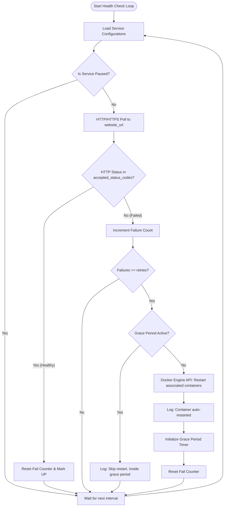

# 🛠️ servworx

<div align="center">
  
</div>


<p align="center">
  <strong>A lightweight, ultra-reliable self-healing Docker container monitor and automatic restarter written in Go.</strong>
</p>

---

[Key Features](#-key-features) • [How it Works](#%EF%B8%8F-how-it-works) • [Getting Started](#-getting-started) • [Configuration Guide](#-configuration-guide) • [Security Best Practices](#%EF%B8%8F-security-best-practices) • [Deployment](#-deployment) • [License](#-license)

</div>

**servworx** is a lightweight, web-based service monitoring and self-healing auto-restart tool for Docker containers. Written in Go, it continuously tracks the availability of specified website URLs or API endpoints. If a service becomes unresponsive or returns error codes, `servworx` acts as an automated operator—automatically restarting the associated Docker containers after a configurable number of retries. 

Designed for high reliability in homelabs and small production setups, `servworx` features a premium, responsive dashboard for live log inspection, state control, and detailed monitoring statistics.

---

## 📸 Dashboards

<p align="center">
  
</p>
<p align="center">
  
</p>

---

## 🌟 Key Features

*   **🔍 Active Service Monitoring**: Continuously polls service endpoints over HTTP/HTTPS with custom interval loops.
*   **🩺 Automatic Container Restart**: Triggers graceful restarts of one or more specified Docker containers using the Docker Engine API when services remain down.
*   **⚙️ In-App Dynamic Configuration**: Add, update, pause, resume, or delete monitored services dynamically through the secure web UI without restarting `servworx`.
*   **⏳ Configurable Grace Periods**: Prevents infinite restart loops by letting containers warm up and stabilize after restarts.
*   **🔒 Built-in User Authentication**: A secure admin portal with forced first-login password changes.
*   **📜 Live Container Log Viewer**: Read the last few lines of Docker container logs directly from the dashboard to debug downtime instantly.
*   **🔌 Self-Signed TLS Support**: Skip TLS verification per-service to monitor internal homelab services running with self-signed SSL/TLS certificates.
*   **⚡ Forced Manual Restarts**: Manually trigger container restarts with a single click.

---

## ⚙️ How it Works

The following flowchart outlines the lifecycle of a `servworx` monitor loop:



---

## 🚀 Getting Started

### Prerequisites

*   [Docker](https://docs.docker.com/get-docker/) installed and running.
*   [Docker Compose](https://docs.docker.com/compose/install/) installed.

### Installation & Setup

1.  **Clone the Repository**
    ```bash
    git clone https://github.com/arumes31/servworx.git
    cd servworx
    ```

2.  **Build and Start with Docker Compose**
    ```bash
    docker compose up --build -d
    ```
    This builds the secure Go application binary using a multi-stage Alpine build, embeds templates, and starts the container on port `7676`.

3.  **Access the Web Interface**
    Open your browser and head to: **`http://localhost:7676`**

    *   **Default Username**: `admin`
    *   **Default Password**: `changeme` (You will be prompted to change this immediately upon your first login).

---

## 📦 Deployment Options

### Using the Pre-Built GHCR Image

If you want to avoid compiling the code locally, use our pre-built image hosted directly on the GitHub Container Registry. Create a `docker-compose.yaml` with the following configuration:

```yaml
services:
  monitor:
    container_name: servworx
    image: ghcr.io/arumes31/servworx:latest
    ports:
      - "7676:5000"
    volumes:
      - /var/run/docker.sock:/var/run/docker.sock
      - ./config:/app/config
    restart: unless-stopped
```

Deploy instantly using:
```bash
docker compose up -d
```

---

## 📘 Configuration Guide

`servworx` persists configurations under the host's `./config` directory, which mounts to `/app/config` inside the container:

*   **`config.json`**: Stores encrypted user credentials and active service monitoring parameters.
*   **`status.json`**: Persists the real-time operational status (uptime/downtime durations, stability counters).

### Example `config.json` Structure
Below is an example of an operational configuration file:

```json
{
    "users": {
        "admin": "$2a$10$tQO2U0s..."
    },
    "services": [
        {
            "name": "Nginx Web Server",
            "website_url": "https://my-website.local",
            "container_names": "nginx-web,nginx-db",
            "retries": 3,
            "interval": 60,
            "grace_period": 300,
            "accepted_status_codes": [200, 201, 301, 302],
            "paused": false,
            "insecure_skip_verify": true,
            "enable_webhook": false,
            "enable_teams": true,
            "enable_telegram": false,
            "enable_email": true
        }
    ]
}
```

### Parameter Explanations

| Parameter | Type | Default | Description |
| :--- | :---: | :---: | :--- |
| `name` | `string` | *Required* | A unique descriptive label for the monitored service. |
| `website_url` | `string` | *Required* | The full HTTP/HTTPS URL of the target endpoint to monitor. |
| `container_names` | `string` | *Required* | Comma-separated list of Docker container names to restart on failure. |
| `retries` | `int` | `15` | Number of consecutive failed polling attempts allowed before trigger. |
| `interval` | `int` | `120` | Polling frequency in seconds between health checks. |
| `grace_period` | `int` | `3600` | Prevention window (in seconds) post-restart to let the service fully boot up before triggering another restart. |
| `accepted_status_codes` | `array` | `[200]` | List of HTTP status codes considered healthy and operational. |
| `paused` | `bool` | `false` | Set to `true` to temporarily disable polling and auto-restarting for this service. |
| `insecure_skip_verify` | `bool` | `false` | Skip SSL certificate validation (useful for internal DNS or self-signed certs). |
| `enable_webhook` | `bool` | `false` | Set to `true` to enable Generic Webhook notification alerts for this service. |
| `enable_teams` | `bool` | `false` | Set to `true` to enable Microsoft Teams webhook notification alerts for this service. |
| `enable_telegram` | `bool` | `false` | Set to `true` to enable Telegram bot notification alerts for this service. |
| `enable_email` | `bool` | `false` | Set to `true` to enable SMTP Email notification alerts for this service. |

---

### 🔔 Notification Setup

`servworx` supports optional, multi-channel notifications (Generic Webhooks, MS Teams, Telegram, and SMTP Email) to alert you whenever a service's state changes (e.g., from `Up` to `Down`, or `Down` to `Up`) or when a container restart is triggered.

Global notification settings (such as API tokens, endpoints, and credentials) are configured securely using **Docker container environment variables**. Once configured, each monitored service can selectively toggle channels on or off directly from the sleek settings panel on the web dashboard.

> [!NOTE]
> All notification channels are executed asynchronously inside high-performance Go goroutines. Slow endpoints, DNS resolutions, or SMTP handshakes will never block or delay your main health-checking threads.

#### 1. Generic Webhook (`enable_webhook`)
Sends a custom HTTP `POST` request with a JSON payload containing the event details.
* **Environment Variable**: `NOTIFICATION_WEBHOOK_URL` (e.g., `http://your-webhook-endpoint.local/alert`)
* **JSON Payload Format**:
  ```json
  {
    "service": "Nginx Web Server",
    "url": "https://my-website.local",
    "status": "Down",
    "timestamp": "2026-05-30 19:15:30",
    "message": "Service status changed from Up to Down"
  }
  ```

#### 2. Microsoft Teams (`enable_teams`)
Dispatches rich, colored Office 365 Connector cards to Microsoft Teams or compatible endpoints.
* **Environment Variable**: `NOTIFICATION_MSTEAMS_URL`
* **Features**: Displays automatic color-coding (vibrant red for downtime, green for recovery) and custom emojis to display event urgency along with metadata on restarted containers.

#### 3. Telegram Bot (`enable_telegram`)
Sends beautifully formatted Markdown alerts directly to a specified personal chat, group, or channel.
* **Environment Variables**:
  * `NOTIFICATION_TELEGRAM_TOKEN`: The API token obtained from [@BotFather](https://t.me/BotFather).
  * `NOTIFICATION_TELEGRAM_CHAT_ID`: The unique target chat or channel ID.

#### 4. SMTP Email (`enable_email`)
Sends standard plain-text e-mail notifications.
* **Environment Variables**:
  * `NOTIFICATION_SMTP_HOST`: The address of the outgoing mail server (e.g., `smtp.gmail.com`).
  * `NOTIFICATION_SMTP_PORT`: The SMTP server port (usually `587` or `25`).
  * `NOTIFICATION_SMTP_USER`: The authentication email address. *Leave blank for unauthenticated local homelab mail relays.*
  * `NOTIFICATION_SMTP_PASS`: The password or app token for the SMTP server.
  * `NOTIFICATION_SMTP_FROM`: The sender email address.
  * `NOTIFICATION_SMTP_TO`: The destination email address.

---

## 🛡️ Security Best Practices

Since `servworx` communicates directly with the Docker Engine to perform self-healing container management, it requires access to the host's `/var/run/docker.sock`. Below are crucial configuration measures to ensure a secure setup:

1.  **Change the Default Admin Password Immediately**: Never leave the default password `changeme` active on public-facing servers.
2.  **Restrict Network Access**: 
    *   Do not expose port `7676` directly to the open web.
    *   Bind it locally (`127.0.0.1:7676:5000`) and put it behind a secure reverse proxy (like Nginx, Traefik, or Caddy) equipped with TLS/SSL.
    *   Alternatively, access the dashboard exclusively via a secure VPN or overlay network (like WireGuard, Tailscale, or OpenVPN).
3.  **Audit Container Name Inputs**: `servworx` incorporates container name validation patterns to avoid command-injection exploits. Always double-check that you only specify exact, valid Docker container names.
4.  **Least Privilege Docker Sock (Optional)**: If you want to limit `servworx` permissions, consider using a Docker Socket proxy (e.g. `tecnativa/docker-socket-proxy`) to only permit `POST /containers/{name}/restart` operations and block access to other critical Docker actions.

---

## 🏛️ Directory Layout

```
.
├── cmd/                          # Command-line entry points
│   └── servworx/
│       └── main.go               # Web server and monitor entry point
├── internal/                     # Private Go packages
│   ├── auth/                     # Session and security handling
│   ├── config/                   # Read, write, and load configurations
│   ├── handlers/                 # HTTP controller logic split by domain
│   │   ├── api_handlers.go       # JSON/SSE endpoints
│   │   ├── web_handlers.go       # HTML page handlers
│   │   ├── helpers.go            # UI formatting and logic helpers
│   │   ├── middleware.go         # Authentication gate
│   │   └── routes.go             # Central router registration
│   └── monitor/                  # Polling engine and Docker restart worker
├── templates/                    # Go HTML layout templates
│   ├── change_password.html      # Authentication profile page
│   ├── config.html               # Main live monitoring dashboard
│   └── login.html                # Web portal login screen
├── Dockerfile                    # Multi-stage optimized Docker build instructions
├── docker-compose.yaml           # Local container orchestration file
├── LICENSE                       # MIT License file
├── go.mod                        # Go module file
└── README.md                     # Modern project overview (this file)
```

---

## 🤝 Contributing

Contributions are welcome! Please feel free to open Issues or submit Pull Requests to help improve `servworx`.

1. Fork the Project.
2. Create your Feature Branch (`git checkout -b feature/amazing-feature`).
3. Commit your Changes (`git commit -m 'Add some amazing-feature'`).
4. Push to the Branch (`git push origin feature/amazing-feature`).
5. Open a Pull Request.

---

## 📄 License

This project is licensed under the MIT License - see the [LICENSE](LICENSE) file for details.
